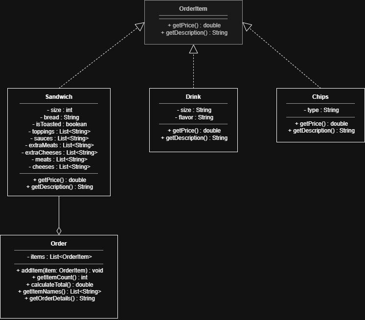

# 🥪 Malone's Deli — Sandwich Ordering App

> "Why waste time say lot word when few word do trick?" — Kevin Malone

Welcome to **Malone's Deli**, a simple console-based program where you can customize sandwich orders, add drinks or chips, and print out a receipt. The whole app is themed after *The Office* !

---

## 🚀 App Features

### 1. Custom Sandwich Configurator
You can build a custom sandwich from scratch step-by-step:
* **Sizes:** 4" Baby Halpert, 8" Just Jim, or a 12" The Big Tuna.
* **Bread Types:** White, Wheat, Rye, or a Wrap.
* **Premium Meats:** Steak, Ham, Salami, Roast Beef, Turkey, or Chicken (or pick option 7 for "The Martin" to skip meat).
* **Extra Meat & Cheese:** You can say "yes" to add extra meat or extra cheese to stack your sandwich higher.
* **Veggies & Sauces:** You can type multiple numbers separated by commas (like `1,2,5`) to add multiple toppings at the same time.
* **Toasting:** Choose whether you want the sandwich toasted or not.

### 2. Breakroom Vending Machines
You can add extra items to your order tray:
* **Cold Drinks:** Pick a size (`Scott's Tot`, `The Toby`, or `Did I Stutter?!`) and flavors like *Schrute Farms Beet Juice* or *Ryan's Tears*.
* **Bags of Chips:** Grab *Prison Mike Salted*, *Scranton Strangler Jalapeno*, *Mose's Mesquite BBQ*, or *Jan's Baked Apple Chips*.

### 3. Checkout Screen
* Shows you the full order details and the final calculated total price.
* If you type "yes" to confirm, it creates a custom ticket ID using the date and time, saves a copy of the receipt to a file, and prints a final pickup ticket.

---

## 🛠️ File Descriptions

Here is a simple breakdown of what each Java file does in this project:

* **`UserInterface.java`**: Handles all the `System.out.println()` menus and uses a `Scanner` to read your choices and inputs.
* **`Order.java`**: Acts like a shopping cart. It holds a list of all the items you want to buy and handles adding items and calculating the total price.
* **`Sandwich.java`**, **`Drink.java`**, and **`Chips.java`**: These are the blueprints for the food items. They hold the variables (like size, bread type, or flavor) and calculate their own individual costs.
* **`ReceiptManager.java`**: Handles writing and saving the final order details into a text file so you have a saved record of the transaction.

---

## 💻 How to Run the App

1. Open this project folder in your IDE (like IntelliJ or Eclipse).
2. Find the file containing the main method (usually `Main.java` or `Program.java`).
3. Click the **Run** button to start the application in your terminal console.

---

## 📝 Example Output Ticket

When you complete an order, the screen displays a ticket that looks like this[cite: 2]:

```text
==========================================================
            ORDER RECEIVED — CUSTOMER TICKET              
==========================================================
  Ticket ID:     #05281430
  Order Time:    02:30 PM
  Est. Pickup:   02:40 PM  (approx. 10 mins)
----------------------------------------------------------
  Your order:
    • 8" Just Jim on Rye (Toasted) - Steak, Extra Swiss
    • Did I Stutter?! (Large) Dr. Pepper
    • Prison Mike Salted Chips
----------------------------------------------------------
  TOTAL PAID:    $14.75
==========================================================

```

## Program Diagram 
